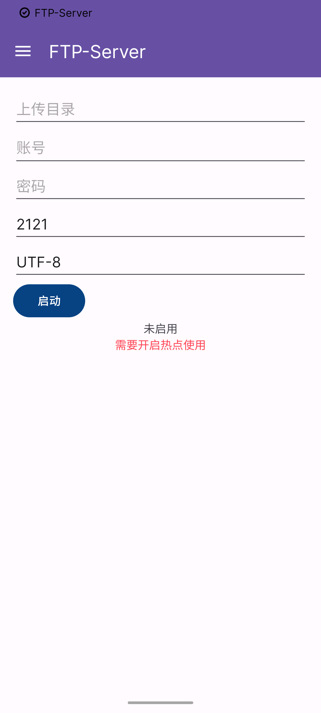

# FTP-SERVER

## Android FTP Server.

> **[中文README](./README_CN.md)**

## Introduction

A simple android FTP tool, built using java Support android to enable FTP server and client.

## Features

- FTP Server
- FTP Client

## Project address

- [FTP-SERVER](https://github.com/Aenlly/FTP-Server)

## Preview

## Usage

1. download APK,[Download address][https://github.com/Aenlly/FTP-Server/releases]
2. To install the app and authorize the storage permissions, the hotspot must be turned on.
3. Enter the folder, user, password and port saved by the uploaded file and click the start button.
4. Once launched, the IP and port are displayed. Other devices connect to the hotspot to transfer files to Android via FTP tool.

# Suggestion

1. [GitHub](https://github.com/Aenlly/FTP-Server/issues)
2. [aenlly123@gmail.com](mailto:aenlly123@gmail.com)

## License

FTP-Server is open-source software licensed under the GPL-3.0 license.
