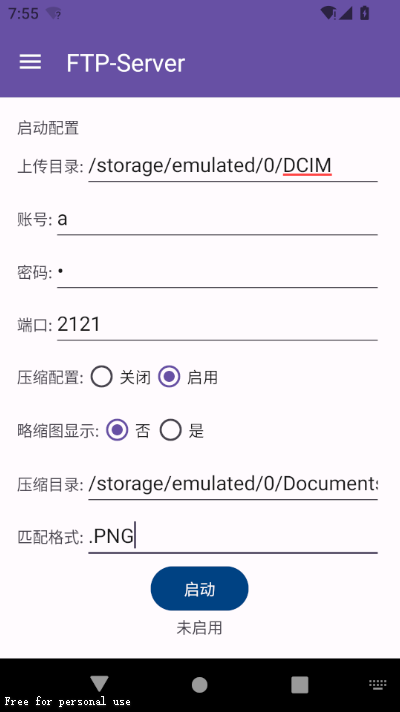
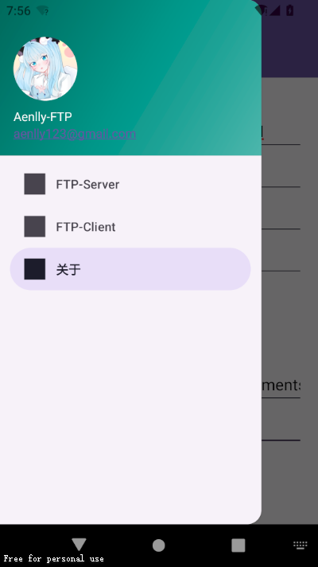

# Aenlly-FTP

## Android FTP服务器.

## 介绍

一个简单的android FTP工具，使用java构建 支持android启用FTP服务器和客户端。

## 环境

- java jdk 17
- gradle 8.2
- idea 2023.3

## 功能

- FTP Server
- FTP Client

## 项目地址

- [Aenlly-FTP](https://github.com/Aenlly/Aenlly-FTP)

## 预览

## 用法

1. 下载APK,[下载地址](https://github.com/Aenlly/Aenlly-FTP/releases)
2. 安装应用程序并授权存储权限，必须打开热点
3. 输入上传文件保存的文件夹、用户、密码和端口，然后单击开始按钮。
4. 启动后，会显示ip和端口。其他设备连接热点通过ftp工具将文件传输到android。

# 建议/反馈

1. [GitHub](https://github.com/Aenlly/Aenlly-FTP/issues)
2. [aenlly123@gmail.com](mailto:aenlly123@gmail.com)

## 许可证

Aenlly-FTP 是工具 GPL-3.0 许可证授权的开源软件。
